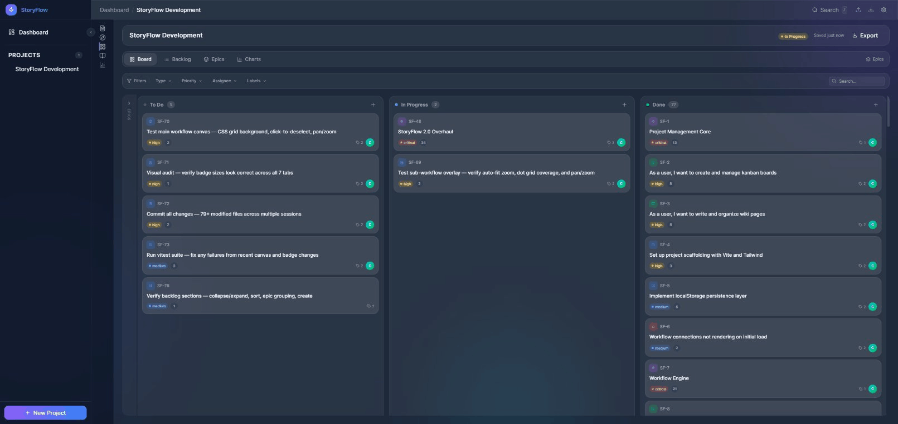
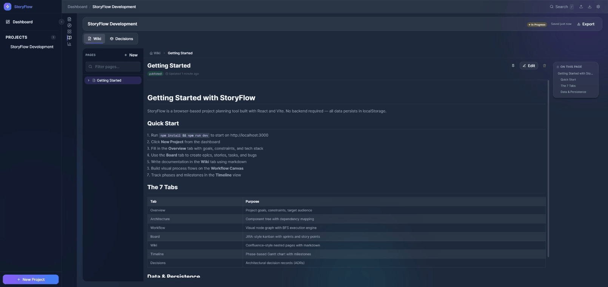
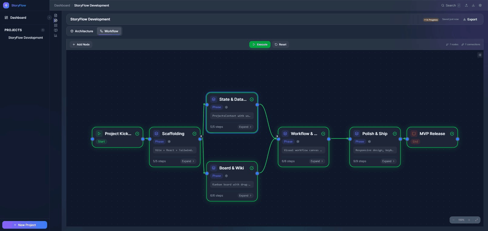
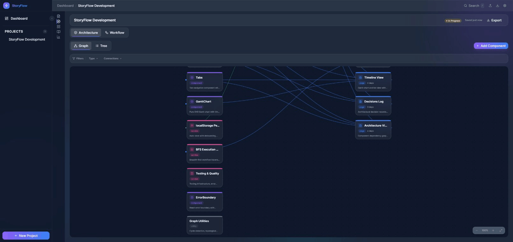

# StoryFlow

A visual project planning and management tool built for AI-assisted software development. StoryFlow combines the best of JIRA, Confluence, and visual workflow tools into a single glassmorphic interface.


## Features

### Board
Full Kanban board with epics, stories, tasks, and bugs. Includes sprint management, backlog grooming, story point estimation, burndown charts, and velocity tracking.



### Wiki
Nested documentation pages with a markdown editor, live preview, page templates, version history, and table of contents generation.



### Workflow Canvas
Visual node graph for planning project phases, dependencies, and execution flow. Supports sub-workflows, pan/zoom, and a BFS execution engine.



### Architecture View
Component tree visualization with dependency mapping, cycle detection, and type-based filtering. Plan your system architecture before writing code.



### Timeline
Phase-based progress tracking with milestone markers, date ranges, and completion percentages.

### Decisions Log
Architectural decision records with alternatives analysis, consequences tracking, and status management.

### Overview
Project dashboard with goals, constraints, tech stack summary, activity feed, and quick stats.

## Design

StoryFlow uses a custom design token system with two themes:

- **Obsidian** -- dark glassmorphic theme with frosted glass panels and depth layering
- **Warm Linen** -- light theme with a warm bone/eggshell palette

All components use semantic CSS variable tokens (`--color-fg-default`, `--color-bg-panel`, etc.) for consistent theming across 80+ components.

## Quick Start

```bash
npm install
npm run dev
```

Opens at [http://localhost:3000](http://localhost:3000).

## Commands

| Command | Description |
|---------|-------------|
| `npm run dev` | Start dev server |
| `npm run build` | Production build |
| `npm run preview` | Preview production build |
| `npm run test` | Run vitest in watch mode |
| `npm run test:run` | Run tests once |
| `npm run lint` | Lint with ESLint |
| `npm run format` | Format with Prettier |

## Tech Stack

| Technology | Purpose |
|-----------|---------|
| React 18 | UI framework |
| Vite 6 | Build tool |
| Tailwind CSS 4.0 | Styling via `@tailwindcss/vite` |
| Framer Motion | Animations |
| Zustand + Dexie | State management with IndexedDB persistence |
| Lucide React | Icons |
| date-fns | Date formatting |
| Vitest | Testing |

## Project Structure

```
src/
  components/
    ui/            Shared components (Button, Modal, Badge, Input, etc.)
    layout/        App shell (Sidebar, Header, Settings, ErrorBoundary)
    project/       Tab components (Board, Wiki, Workflow, Architecture, etc.)
    board/         Kanban board (SprintBoard, BacklogView, IssueCard, etc.)
    wiki/          Documentation (PageTree, PageEditor, MarkdownRenderer)
    workflow/      Visual canvas (WorkflowCanvas, WorkflowNode, NodePalette)
    architecture/  Component tree (ComponentDetail, DependencyGraph)
    timeline/      Phase tracking (PhaseCard, MilestoneMarker)
    decisions/     Decision records (DecisionCard, DecisionForm)
    activity/      Activity feed
  pages/           Dashboard, Project, 404
  hooks/           Custom hooks (useProject, useDragAndDrop, useCanvasPan, etc.)
  contexts/        ProjectsContext (React Context + Zustand)
  stores/          Zustand stores (projects, activity, UI)
  styles/          Design tokens (tokens.css)
  utils/           Helpers (markdown, sanitize, graph, colors, export/import)
  data/            Seed data, defaults, templates, node types
```

## Data Model

Projects are persisted in IndexedDB (with localStorage fallback) and can be exported/imported as JSON. Each project contains:

- **Overview** -- goals, constraints, tech stack, target audience
- **Architecture** -- component tree with types and dependencies
- **Workflow** -- visual node graph with execution engine
- **Board** -- issues (epics/stories/tasks/bugs), sprints, status columns
- **Wiki** -- nested pages with markdown content and version history
- **Timeline** -- phases with progress tracking and milestones
- **Decisions** -- architectural decisions with alternatives and consequences

## Deployment

StoryFlow is a static client-side SPA with no backend. Deploy the `dist/` folder to any static hosting provider:

```bash
npm run build    # Produces dist/
```

| Provider | Command |
|----------|---------|
| **Vercel** | `npx vercel --prod` |
| **Netlify** | Drag `dist/` to Netlify dashboard, or `npx netlify deploy --prod --dir=dist` |
| **GitHub Pages** | Use `gh-pages` package or Actions workflow |
| **S3 + CloudFront** | `aws s3 sync dist/ s3://your-bucket --delete` |

For SPA routing, configure your host to serve `index.html` for all paths (Vercel and Netlify handle this automatically).

## License

MIT
