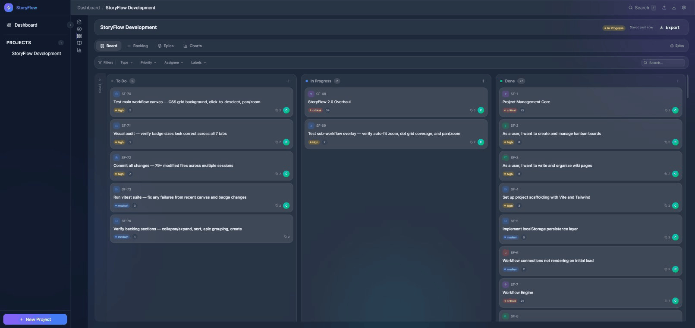
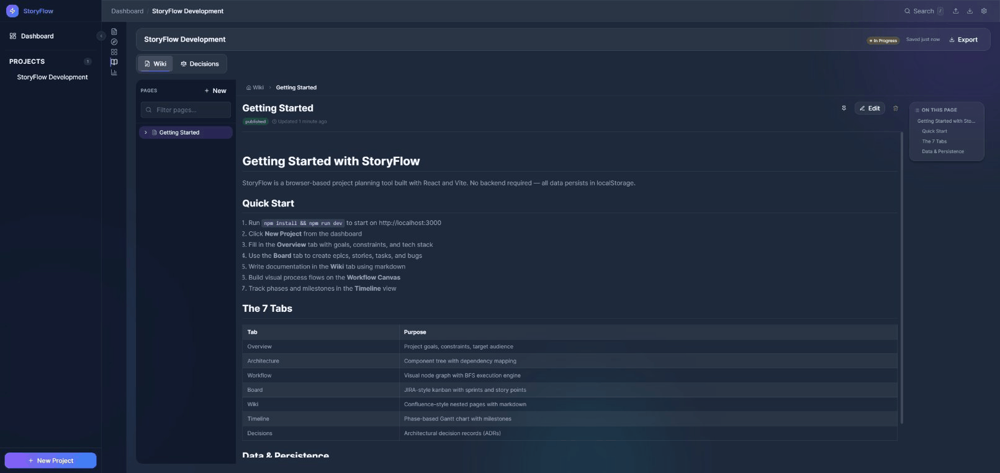
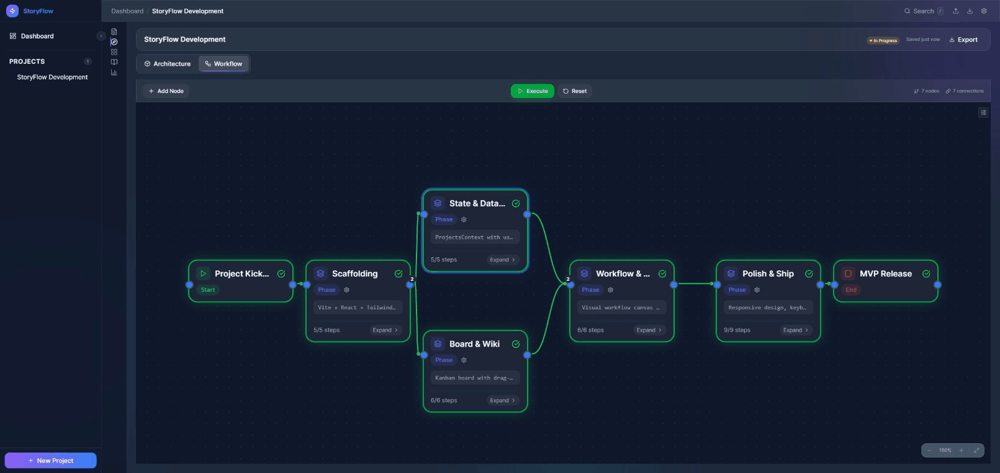
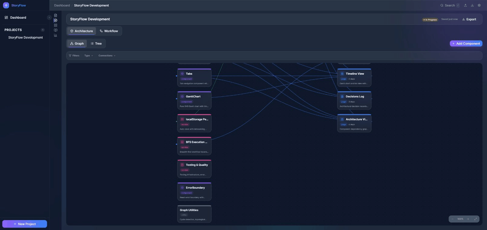
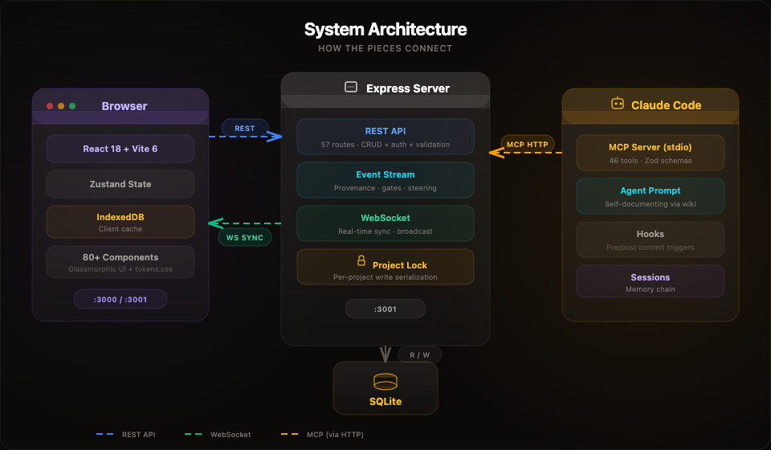
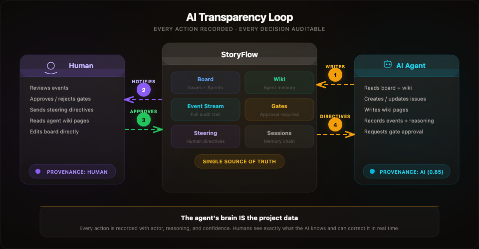

# StoryFlow

**The first project management tool designed for AI agents, not just humans.**

Every board, sprint, wiki page, and decision record in StoryFlow is exposed as an MCP tool — so Claude Code and other AI coding agents can read your backlog, create issues, update docs, and track progress while they work alongside you. No copy-pasting context between tabs. No browser window your AI can't see.

It's also the tool you'd want even without AI: a Kanban board with sprints and burndown charts, a wiki with live markdown preview, a visual workflow canvas, architecture diagrams, decision logs, and timeline tracking — all in one local-first app with a glassmorphic UI. Think JIRA + Confluence + Miro, minus the SaaS bill and the latency.

Your data stays on your machine in SQLite and IndexedDB. No accounts, no cloud sync, no telemetry.

### Why StoryFlow is Different

Most AI agent frameworks focus on the model — better prompts, chain-of-thought, tool use. StoryFlow focuses on the **infrastructure around the model** — persistence, transparency, human-in-the-loop steering, and session chaining.

The core insight: **the agent's brain should be the same data store the human sees.** Wiki pages are the agent's memory. Events are the audit trail. Gates are the guardrails. There is no hidden state — if the agent knows it, you can read it; if you correct it, the agent sees the correction immediately.

This eliminates the three problems that plague autonomous coding agents:

1. **The black-box problem** — you can't see what the agent knows or why it made a decision. StoryFlow records every action with actor, reasoning, and confidence score.
2. **The context-loss problem** — agents forget everything between sessions. StoryFlow chains sessions through persistent wiki pages and session summaries the agent reads on startup.
3. **The steering problem** — you can't redirect an agent mid-task without restarting it. StoryFlow's steering queue and gate approvals let you course-correct in real time.


## Features

### Board
Full Kanban board with epics, stories, tasks, and bugs. Includes sprint management, backlog grooming, story point estimation, burndown charts, and velocity tracking. Supports Blocked status with `blockedAt` lifecycle timestamps.



### AI Transparency & Autonomy (v2)
Real-time visibility into everything the AI agent does:

- **Gate Approvals** -- pending gates surface as prominent action cards; approve or reject with optional comments before the agent proceeds
- **Escalation Response** -- when the AI is blocked, respond directly with steering directives
- **Sprint Metrics** -- CSS-only velocity bars, status distribution charts, cycle time and blocked time analytics computed from board data
- **Session History** -- collapsible timeline of past agent sessions showing work done, decisions, learnings, and next steps
- **Event Feed** -- live activity stream with provenance badges, confidence scores, and category filters
- **Steering Bar** -- direct the agent's focus with free-text directives or quick-action chips

### Wiki
Nested documentation pages with a markdown editor, live preview, page templates, version history, and table of contents generation.



### Workflow Canvas
Visual node graph for planning project phases, dependencies, and execution flow. Supports sub-workflows, pan/zoom, and a BFS execution engine.



### Architecture View
Component tree visualization with dependency mapping, cycle detection, and type-based filtering. Plan your system architecture before writing code.



### Timeline
Phase-based progress tracking with milestone markers, date ranges, and completion percentages.

### Decisions Log
Architectural decision records with alternatives analysis, consequences tracking, and status management.

### Overview
Project dashboard with AI status, gate approvals, metrics (AI actions, human overrides, velocity, blocked count), sprint analytics, activity feed, session history, and steering controls.

## Design

StoryFlow uses a custom design token system with two themes:

- **Obsidian** -- dark glassmorphic theme with frosted glass panels and depth layering
- **Warm Linen** -- light theme with a warm bone/eggshell palette

All components use semantic CSS variable tokens (`--color-fg-default`, `--color-bg-panel`, `--color-ai-accent`, `--color-confidence-*`, etc.) for consistent theming across 80+ components.

## Quick Start

```bash
npm install          # Installs client + server dependencies
npm run dev:full     # Starts Express server + Vite dev server
```

This starts two processes:

- **Vite dev server** on [http://localhost:3000](http://localhost:3000) -- open this in your browser
- **Express API server** on port 3001 -- Vite proxies `/api` requests automatically

In production, only the Express server runs (on port 3001) and serves both the API and the built frontend.

## Commands

| Command | Description |
|---------|-------------|
| `npm run dev:full` | Start server + client together |
| `npm run dev` | Start Vite dev server only (client) |
| `npm run server` | Start Express API server only |
| `npm run build` | Production build |
| `npm run preview` | Preview production build |
| `npm run test` | Run vitest in watch mode |
| `npm run test:run` | Run tests once |
| `npm run lint` | Lint with ESLint |
| `npm run format` | Format with Prettier |

## Tech Stack

### Client

| Technology | Purpose |
|-----------|---------|
| React 18 | UI framework |
| Vite 6 | Build tool + dev server |
| Tailwind CSS 4.0 | Styling via `@tailwindcss/vite` |
| Framer Motion | Animations + CSS-only charts |
| Zustand + Dexie | State management with IndexedDB persistence |
| Lucide React | Icons |
| date-fns | Date formatting |
| Vitest | Testing |

### Server

| Technology | Purpose |
|-----------|---------|
| Express 4 | HTTP API server |
| sql.js | SQLite database (pure JS, no native deps) |
| ws | WebSocket server for real-time sync |

## Architecture



The client stores data in IndexedDB for fast access. The Express server persists data in SQLite for durability. WebSocket notifications keep them in sync — changes from one source propagate to the other automatically. The AI agent reads and writes through the **same data store** the human sees — there is no separate agent memory.

### AI Transparency Loop



Every AI action is recorded as an event with provenance (actor, reasoning, confidence). Gate events require human approval before the agent proceeds. Steering directives flow back to the agent via a queue. The result: **full auditability with zero overhead** — the agent's normal workflow produces the audit trail automatically.

## Project Structure

```
plugin/              Claude Code plugin (MCP server, commands, skills)
server/              Express backend (app.js, db.js, events.js, intelligence.js, ws.js)
src/
  components/
    ui/              Shared components (Button, Modal, Badge, GlassCard, ProvenanceBadge, etc.)
    layout/          App shell (Sidebar, Header, Settings, ErrorBoundary)
    project/         Tab components (Board, Wiki, Workflow, Architecture, etc.)
    overview/        AI dashboard (AIStatusCard, GatePanel, MetricsSummary,
                     SprintMetricsPanel, EventFeed, SessionHistory, SteeringBar)
    board/           Kanban board (SprintBoard, BacklogView, IssueCard, etc.)
    wiki/            Documentation (PageTree, PageEditor, MarkdownRenderer)
    workflow/        Visual canvas (WorkflowCanvas, WorkflowNode, NodePalette)
    architecture/    Component tree (ComponentDetail, DependencyGraph)
    timeline/        Phase tracking (PhaseCard, MilestoneMarker)
    decisions/       Decision records (DecisionCard, DecisionForm)
  pages/             Dashboard, Project, 404
  hooks/             Custom hooks (useProject, useDragAndDrop, useCanvasPan, etc.)
  contexts/          ProjectsContext (React Context + Zustand)
  stores/            Zustand stores (projects, events, UI)
  styles/            Design tokens (tokens.css)
  utils/             Helpers (markdown, sanitize, graph, colors, staleness, export/import)
  data/              Seed data, defaults, templates, node types
data/                SQLite database (auto-created on first run, gitignored)
```

## Data Model

Projects are persisted in both IndexedDB (client) and SQLite (server). The server is the source of truth -- data survives browser clears and server restarts. Each project contains:

- **Overview** -- goals, constraints, tech stack, target audience
- **Architecture** -- component tree with types and dependencies
- **Workflow** -- visual node graph with execution engine
- **Board** -- issues (epics/stories/tasks/bugs), sprints, status columns (To Do, In Progress, Blocked, Done)
- **Wiki** -- nested pages with markdown content and version history
- **Timeline** -- phases with progress tracking and milestones
- **Decisions** -- architectural decisions with alternatives and consequences

Issue lifecycle timestamps: `todoAt`, `inProgressAt`, `blockedAt`, `doneAt` -- enabling cycle time and blocked time analytics.

## Claude Code Plugin

StoryFlow includes a Claude Code plugin that lets Claude manage projects, issues, sprints, and wiki pages directly from any codebase.

> **Note:** Claude Code will show an MCP server warning during installation. This is standard for all plugins with MCP servers. The StoryFlow MCP server only communicates with your local StoryFlow instance — it does not access your filesystem or external services. See [`plugin/README.md`](plugin/README.md#security-note) for details.

### Install

```bash
claude plugin add /path/to/StoryFlow/plugin
```

### Setup

```bash
/storyflow:setup     # Configure the StoryFlow URL (default: http://localhost:3001)
```

Configuration is saved to `~/.config/storyflow/config.json` and persists across all Claude Code sessions.

### Commands

| Command | Description |
|---------|-------------|
| `/storyflow:setup` | Configure StoryFlow URL |
| `/storyflow:sync` | Check connectivity and sync status |
| `/storyflow:open` | Open StoryFlow UI in browser |
| `/storyflow:board [project]` | Show board summary for a project |

### MCP Tools (46)

The plugin exposes 46 MCP tools across 11 categories that Claude can use automatically during development:

| Category | Tools | Examples |
|----------|-------|---------|
| **Projects** | 6 | `list_projects`, `create_project`, `update_project`, `advance_phase` |
| **Issues** | 7 | `create_issue`, `update_issue`, `batch_update_issues`, `add_comment`, `nudge_issue` |
| **Sprints** | 5 | `create_sprint`, `update_sprint`, `sprint_metrics` |
| **Board** | 2 | `get_board_summary`, `run_hygiene` |
| **Wiki** | 5 | `create_page`, `get_page`, `update_page` |
| **Decisions** | 3 | `create_decision`, `update_decision`, `delete_decision` |
| **Timeline** | 6 | `create_phase`, `update_phase`, `delete_phase`, `create_milestone`, `update_milestone`, `delete_milestone` |
| **Sessions** | 3 | `save_session_summary`, `get_last_session`, `list_sessions` |
| **Transparency** | 8 | `record_event`, `query_events`, `update_ai_status`, `check_gates`, `escalate` |
| **Git** | 1 | `sync_from_git` |

All tools are prefixed with `storyflow_`. `list_issues` supports pagination (`page`, `limit`), text search, and a compact `fields=summary` mode for large projects. `update_project` accepts `techStack`, `overview`, `architecture`, and `timeline` fields in addition to name/description/status. See [`plugin/skills/storyflow/SKILL.md`](plugin/skills/storyflow/SKILL.md) for the full tool reference.

## Security

StoryFlow is intended for **local single-user use only**. It is not designed or hardened for multi-user or public-facing deployments.

### Threat Model

The primary threat StoryFlow guards against is **unauthorized tool access** — preventing untrusted MCP clients or rogue processes from reading and modifying your project data through the API.

**What's protected:**

- MCP tool calls require a shared secret (`MCP_AUTH_TOKEN`) passed as a Bearer token. Without it, all tool requests are rejected with `401 Unauthorized`.
- The token is validated using constant-time comparison to prevent timing attacks.
- The `/api/sync` endpoint requires an explicit `X-Confirm: overwrite-all` header and rejects empty payloads to prevent accidental data wipes.
- A write lock on sync prevents concurrent sync + mutation races.

**What's NOT in scope:**

- **Network-level security.** By default the server binds to `127.0.0.1` (localhost). If you bind to `0.0.0.0` or expose the port externally, you must provide your own controls (firewall rules, reverse proxy with TLS, VPN, etc.).
- **Encryption at rest.** The SQLite database is stored unencrypted on disk. Protect it with filesystem permissions.
- **Multi-user access control.** There are no user accounts, roles, or per-user permissions. Anyone with the token has full access.

### Recommendations

- Always set `MCP_AUTH_TOKEN` to a strong random value (e.g., `openssl rand -hex 32`).
- Never commit the token to version control — use environment variables or a `.env` file.
- Do not expose the server port to untrusted networks without additional safeguards.

## Deployment

StoryFlow requires the Express server for data persistence. Build the client and run the server:

```bash
npm run build        # Produces dist/
npm run server       # Express serves dist/ + API on port 3001
```

The server auto-detects `dist/` and serves it as static files alongside the API. Open [http://localhost:3001](http://localhost:3001) in production mode.

To change the server port, set the `STORYFLOW_PORT` environment variable:

```bash
STORYFLOW_PORT=8080 npm run server
```

## License

Copyright (c) 2026 Sheldon Spence. See [LICENSE](LICENSE) for details.
