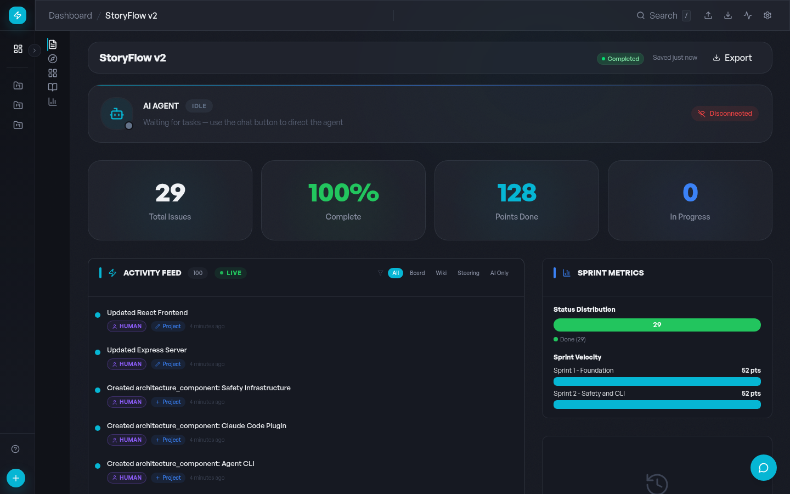
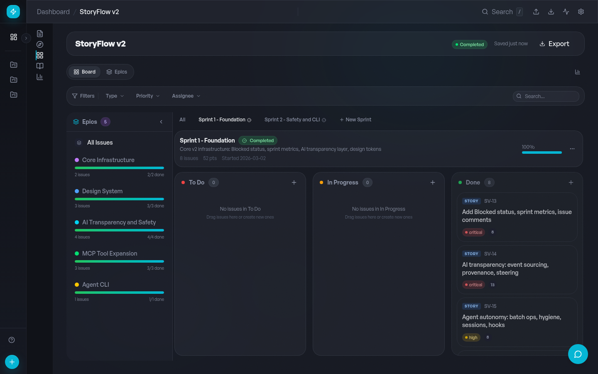
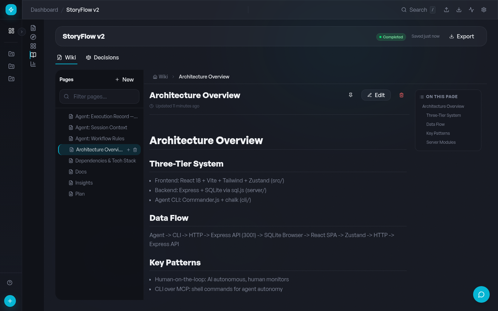
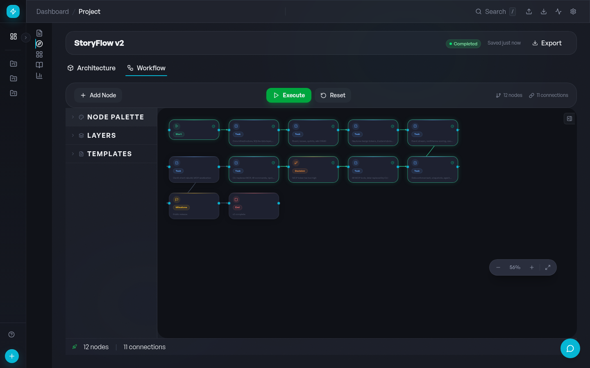
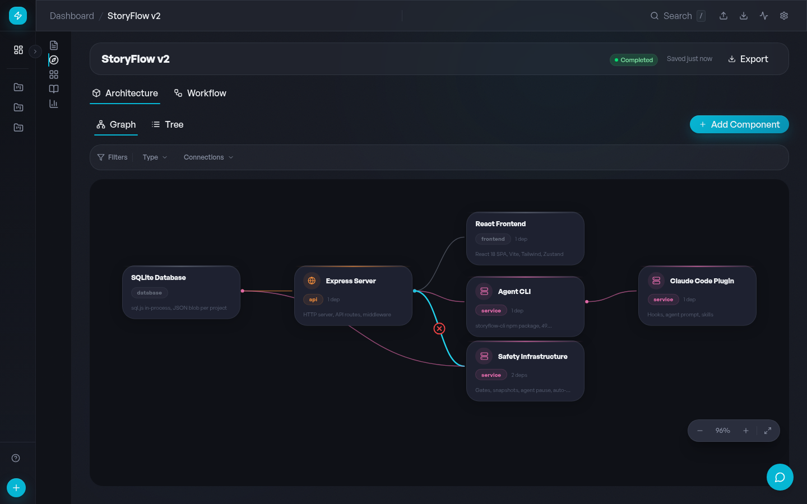
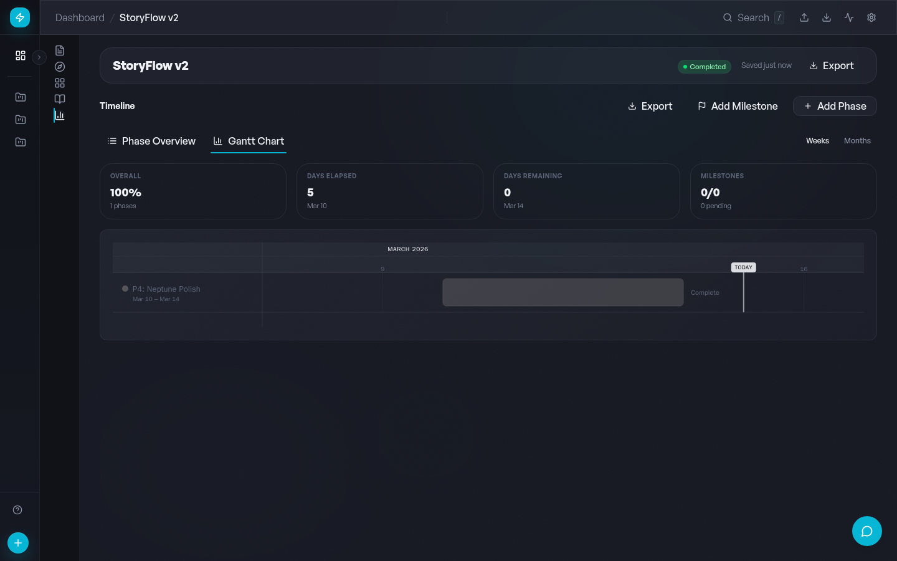

# StoryFlow

**Project management built for AI agents, not just humans.**

StoryFlow gives autonomous coding agents persistent memory, transparent decision-making, and human-on-the-loop steering — through the same board, wiki, and timeline that you see. No hidden state. If the agent knows it, you can read it. If you correct it, the agent sees it immediately.

It's also a full project management tool: Kanban board with sprints, wiki with markdown preview, workflow canvas, architecture diagrams, decision logs, and timeline tracking. Local-first. No accounts, no cloud, no telemetry.


---

## What's New in v2

### Neptune Design System
Complete visual identity overhaul. Cool charcoal palette with frosted glass surfaces, General Sans typography, and semantic design tokens powering two themes — **Obsidian** (dark glassmorphic) and **Warm Linen** (light, warm bone/eggshell). Every pixel earns its space.

### Agent CLI
The `storyflow-cli` npm package provides direct shell commands for every StoryFlow operation. 49 commands covering the full project lifecycle. Smart project resolution (type a name prefix, not a UUID), `--json` for piping, and full API coverage.

```bash
npm i -g storyflow-cli
storyflow-cli board                      # Visual board summary
storyflow-cli issues done PRJ-42         # Mark issue as Done
storyflow-cli steer "Focus on auth"      # Send steering directive
```

### 5 Mechanical Safety Rails
Invisible on the happy path, block only when needed:

- **Gate enforcement** — AI mutations on gated entities return 403 until you approve
- **Confidence auto-gating** — uncertain AI actions (confidence < 0.5) auto-create pending gates
- **Snapshots & undo** — auto-snapshot before every destructive mutation; 20-cap LRU per project
- **Agent pause** — escalations block all AI writes until you respond
- **Causal event chains** — full audit trail with `parent_event_id` linking gate approvals to downstream mutations

### Live AI Dashboard
Real-time overview with WebSocket-powered status card, event feed with provenance badges (who did what, why, and how confident), sprint metrics with velocity/burndown, and session history. Steering bar for mid-task course correction without restarting the agent.



---

## The Problem

Autonomous coding agents hit three walls:

1. **Black box** — you can't see what the agent knows or why it decided something. StoryFlow records every action with actor, reasoning, and confidence score.
2. **Context loss** — agents forget everything between sessions. StoryFlow chains sessions through persistent wiki pages and summaries the agent reads on startup.
3. **No steering** — you can't redirect an agent mid-task without restarting it. StoryFlow's steering queue and gate approvals let you course-correct in real time.

## Quick Start

```bash
git clone https://github.com/venom444556/StoryFlow.git
cd StoryFlow
npm install
npm run dev          # Express + Vite on a single port
```

Open [http://localhost:3001](http://localhost:3001) in your browser.

## Agent CLI

The `storyflow-cli` package gives agents (and humans) direct terminal access to StoryFlow — 49 commands covering the full project lifecycle.

```bash
npm i -g storyflow-cli
storyflow-cli config set-url http://your-server:3001
storyflow-cli config set-default my-project
```

```bash
storyflow-cli board                      # Visual board summary
storyflow-cli issues list -s "Blocked"   # Filter issues
storyflow-cli issues done PRJ-42         # Mark issue as Done
storyflow-cli steer "Focus on auth"      # Send steering directive
storyflow-cli hygiene                    # Board health check
storyflow-cli workflow list              # Workflow canvas nodes
storyflow-cli architecture list          # Architecture components
storyflow-cli decisions list             # Architecture decision records
```

Smart project resolution — type a name prefix instead of UUIDs. Every command supports `--json` for piping.

See the full command reference at [npmjs.com/package/storyflow-cli](https://www.npmjs.com/package/storyflow-cli).

## Features

### Board
Kanban board with epics, stories, tasks, and bugs. Sprint management, backlog grooming, story point estimation, burndown charts, velocity tracking. Supports Blocked status with lifecycle timestamps.



### AI Transparency & Safety
Five mechanical safety rails — invisible on the happy path, block only when needed:

- **Gate enforcement** — AI mutations on gated entities are blocked (403) until you approve
- **Confidence auto-gating** — low-confidence AI actions automatically create pending gates
- **Snapshots & undo** — auto-snapshot before every destructive mutation; restore any snapshot
- **Agent pause** — escalations block all mutating operations until you respond
- **Causal event chains** — full audit trail from gate approval through subsequent mutations

Plus: event feed with provenance badges, session history, sprint metrics, and a steering bar for real-time directives.

### Wiki
Nested documentation pages with markdown editor, live preview, page templates, and version history. The agent uses wiki pages as persistent memory across sessions.



### Workflow Canvas
Visual node graph for project phases, dependencies, and execution flow. Supports sub-workflows, pan/zoom, and auto-sync with issue status.



### Architecture View
Component tree with dependency mapping, cycle detection, and type-based filtering.



### Timeline & Decisions
Gantt chart with phase bars, milestone diamonds, and responsive rendering. Architectural decision records with alternatives analysis and consequences tracking.



## Architecture

```
cli/                 Agent CLI (npm: storyflow-cli)
  src/commands/      49 commands: issues, board, sprints, pages, workflow,
                     architecture, decisions, phases, milestones, events, etc.
server/              Express backend
  app.js             API routes + middleware
  db.js              SQLite data layer (sql.js, JSON blob per project)
  events.js          Transparency event stream, causal chains
  intelligence.js    AI steering, confidence scoring, gate enforcement
  ws.js              WebSocket server for real-time updates
src/
  components/
    ui/              Shared components (Button, Modal, Badge, GlassCard, etc.)
    layout/          App shell (Sidebar, Header, Settings)
    project/         Tab components (Board, Wiki, Workflow, Architecture, etc.)
    overview/        AI dashboard (GatePanel, MetricsSummary, EventFeed, SteeringBar)
    board/           Kanban board (SprintBoard, BacklogView, IssueCard)
    wiki/            Documentation (PageTree, PageEditor, MarkdownRenderer)
    workflow/        Visual canvas (WorkflowCanvas, WorkflowNode)
    architecture/    Component tree (ComponentDetail, DependencyGraph)
    timeline/        Gantt chart (GanttChart, GanttBar, GanttMilestone, GanttTimeAxis)
    decisions/       Decision records (DecisionCard, DecisionForm)
  stores/            Zustand stores (projects, events, UI)
  styles/            Design tokens (tokens.css)
  utils/             Markdown parser, sanitizer, export/import
plugin/              Claude Code plugin (hooks, agent prompt, skills)
```

### Data Model

Each project contains: board (issues + sprints), wiki pages, workflow (node graph), architecture (component tree), timeline (phases + milestones), and decisions. All stored as a JSON blob in SQLite with per-project write locks.

Issue lifecycle timestamps (`todoAt`, `inProgressAt`, `blockedAt`, `doneAt`) enable cycle time and blocked time analytics.

### Design Tokens

Two themes via semantic CSS variables:

- **Obsidian** — dark glassmorphic with frosted glass panels, cool charcoal palette
- **Warm Linen** — light theme with warm bone/eggshell palette

## Tech Stack

| Layer | Technology |
|-------|-----------|
| Frontend | React 18, Vite 6, Tailwind CSS 4.0, Zustand, Framer Motion |
| Backend | Express 4, sql.js (SQLite), WebSocket |
| CLI | Commander.js, chalk |
| Virtualization | @tanstack/react-virtual |
| Persistence | SQLite (server), Dexie/IndexedDB (client) |

## Commands

| Command | Description |
|---------|-------------|
| `npm run dev` | Express + Vite dev server (single process, port 3001) |
| `npm run dev:vite` | Standalone Vite dev server (port 3000, no API) |
| `npm run build` | Production build |
| `npm run test` | Run tests (vitest) |
| `npm run lint` | Lint with ESLint |
| `npm run ci` | Full CI pipeline (format + lint + typecheck + test + build) |

## Security

StoryFlow is for **local single-user use**. The primary threat model is unauthorized tool access.

**Protected:**
- API token auth (`STORYFLOW_TOKEN`) with constant-time comparison
- Loopback binding (`127.0.0.1` by default)
- CORS restricted to known UI origins
- Gate enforcement blocks AI mutations on gated entities
- Confidence auto-gating on uncertain decisions
- Agent pause on escalation
- Auto-snapshots before destructive mutations (20 per project, LRU eviction)
- Causal event chains for full audit trails

**Not in scope:** network-level security (bind to `0.0.0.0` at your own risk), encryption at rest, multi-user access control.

**Recommendations:** Set a strong token (`openssl rand -hex 32`), don't expose the port to untrusted networks, never commit tokens to version control.

See [SECURITY.md](SECURITY.md) for full security policy and vulnerability reporting.

## Deployment

```bash
npm run build                          # Produces dist/
NODE_ENV=production node server/index.js  # Express serves dist/ + API on port 3001
```

Set `STORYFLOW_PORT` to change the port. Set `STORYFLOW_HOST` to change the bind address (default: `127.0.0.1`).

## License

Copyright (c) 2026 Sheldon Spence. See [LICENSE](LICENSE) for details.
